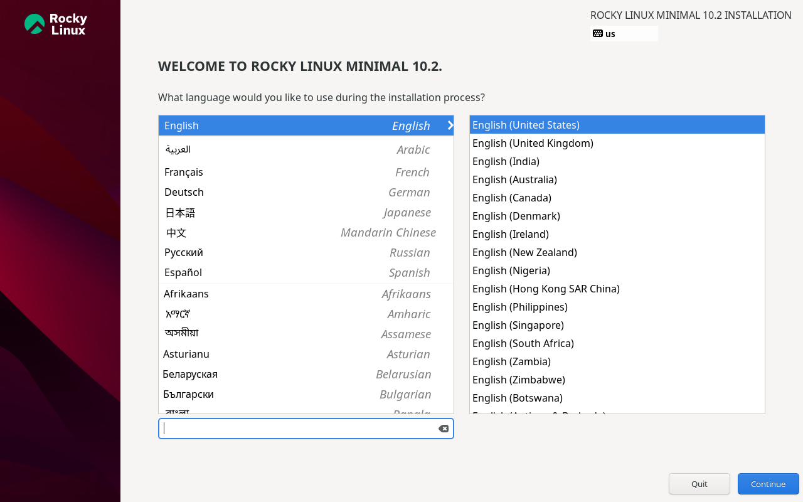
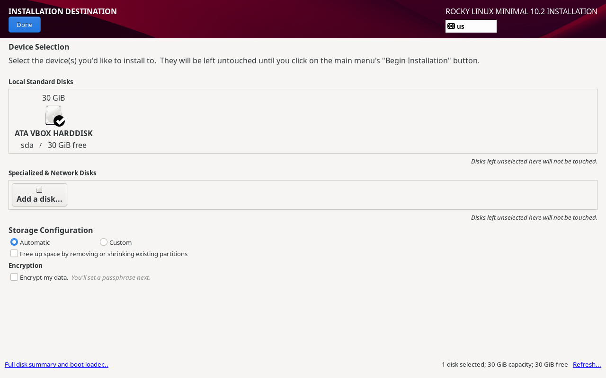

# Rocky Linux Installation

## Installation Source

Rocky Linux Minimal ISO

## Software Selection

Minimal Install

## Disk Configuration

Automatic Partitioning

## Time Zone

UTC

## Root Password

Configured during installation.

## Reboot

System rebooted successfully.

