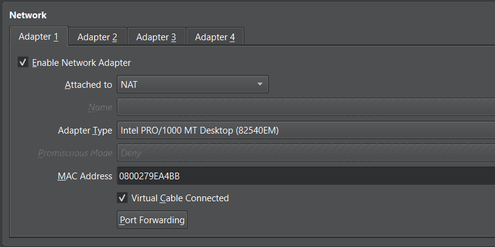

# Remote SSH Access

## Objective

Configure remote SSH access to the Rocky Linux server through a dedicated Host-Only network in VirtualBox.

The server uses:

- **NAT** for Internet connectivity.
- **Host-Only networking** for private management access from the Windows host and WSL.
- **SSH** for remote administration.

## Network Architecture

The Rocky Linux VM uses two virtual network adapters:

```text
                    Internet
                       │
                       │
                      NAT
                       │
                       ▼
              ┌─────────────────┐
              │   Rocky Linux   │
              │     ei-core     │
              │                 │
              │  enp0s3         │
              │  10.0.2.x       │
              │                 │
              │  enp0s8         │
              │ 192.168.56.x    │
              └────────┬────────┘
                       │
                 Host-Only Network
                       │
                       ▼
              ┌─────────────────┐
              │ Windows Host    │
              │       +         │
              │      WSL        │
              └─────────────────┘
```

### Network Roles

| Adapter | VirtualBox Mode | Purpose |
|---|---|---|
| Adapter 1 | NAT | Internet connectivity |
| Adapter 2 | Host-Only | Private management and SSH access |

---

## 1. Create the Host-Only Network

Power off the Rocky Linux VM before modifying its network configuration.

In VirtualBox, navigate to Tools → Network

You will find **Host-Only Network** with IP assigned to it. If not, you can create a new one.

Example configuration:

```text
IPv4 Address: 192.168.56.1
IPv4 Network Mask: 255.255.255.0
```

DHCP can remain enabled so that VirtualBox automatically assigns an IP address to the VM.


## 2. Add the Host-Only Adapter

Open:

```text
VirtualBox → ei-core → Settings → Network
```

Keep the existing NAT adapter:

```text
Adapter 1:
    Enable Network Adapter: Yes
    Attached to: NAT
```


Configure the second adapter:

```text
Adapter 2:
    Enable Network Adapter: Yes
    Attached to: Host-Only Adapter
```


Select the Host-Only network.

The final configuration should be:

```text
Adapter 1 → NAT
Adapter 2 → Host-Only Adapter
```

Start the Rocky Linux VM.

## 3. Verify the Network Interfaces

On Rocky Linux, check the available network interfaces:

```bash
ip addr
```

Expected output:

```text
enp0s3
    inet 10.0.2.15/24

enp0s8
    inet 192.168.56.101/24
```

The important distinction is:

- `10.0.2.x` → NAT / Internet connectivity
- `192.168.56.x` → Host-Only / management connectivity

Record the Host-Only IP address.

Example:

```text
192.168.56.101
```

## 4. Verify SSH

Make sure the SSH service is running:

```bash
sudo systemctl status sshd
```

Verify that SSH is listening on port 22:

```bash
sudo ss -tlnp | grep :22
```

SSH should be listening before attempting remote access.

## 5. Test SSH Using the IP Address

From Windows PowerShell:

```powershell
ssh lilli@192.168.56.101
```

From WSL:

```bash
ssh lilli@192.168.56.101
```

A successful connection should provide a shell on the Rocky Linux server:

```text
[lilli@ei-core ~]$
```


## 6. Configure Hostname-Based SSH Access

Using an IP address works, but using the server hostname is easier to remember:

```bash
ssh lilli@ei-core
```

The hostname must resolve to the server's Host-Only IP address.

For this homelab, local hostname resolution is configured using the `hosts` file.

### Windows

Open PowerShell **as Administrator**:

```powershell
notepad C:\Windows\System32\drivers\etc\hosts
```

Add:

```text
192.168.56.101    ei-core
```

Replace the IP address with the actual Host-Only IP.

Verify from PowerShell:

```powershell
ping ei-core
```

The result should show that `ei-core` resolves to the configured IP address.

Then test SSH:

```powershell
ssh lilli@ei-core
```

### WSL

Check whether WSL can resolve the hostname:

```bash
getent hosts ei-core
```

If it does not return an address, edit the WSL hosts file:

```bash
sudo vim /etc/hosts
```

Add:

```text
192.168.56.101    ei-core
```

Verify:

```bash
getent hosts ei-core
```

Expected result:

```text
192.168.56.101    ei-core
```

Then connect using:

```bash
ssh lilli@ei-core
```

## 7. Verify the Rocky Linux Hostname

On Rocky Linux:

```bash
hostname
```

Expected:

```text
ei-core
```

For more detailed information:

```bash
hostnamectl
```

The static hostname should be:

```text
Static hostname: ei-core
```

## Result

The Rocky Linux server can now be remotely administered through its private Host-Only network.

SSH access is available using either the IP address:

```bash
ssh lilli@192.168.56.101
```

or the hostname:

```bash
ssh lilli@ei-core
```

The final network design separates the server's connectivity:

```text
NAT
 └── Internet access

Host-Only
 └── Private management network
      └── SSH → ei-core
```

---

## Notes

- The Host-Only adapter provides private management connectivity between the Windows host and the Rocky Linux server.
- The NAT adapter remains responsible for Internet access.
- The Host-Only IP may change when DHCP is enabled.
- The `hosts` file approach is suitable for a small homelab. Larger environments typically use DNS for centralized hostname resolution.
- SSH hardening is documented separately in `ssh-hardening.md`.
- The VirtualBox console remains useful for initial setup, network recovery, and troubleshooting when SSH is unavailable.